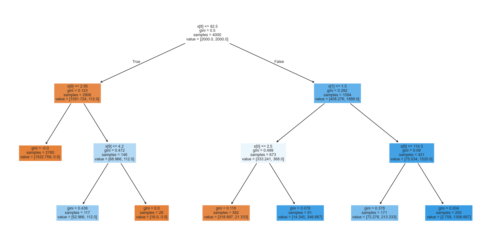

## Project Machine Learning - Loan Campaign
### Personal Loan - Advertising Model
- Class: UT ML/AC Certificate:
- Name: Daniel Levenstein
- Submission Date: 09/5/2025

## Problem Statement

### Context

AllLife Bank is a US bank that has a growing customer base. The majority of these customers are liability customers (depositors) with varying sizes of deposits. The number of customers who are also borrowers (asset customers) is quite small, and the bank is interested in expanding this base rapidly to bring in more loan business and in the process, earn more through the interest on loans. In particular, the management wants to explore ways of converting its liability customers to personal loan customers (while retaining them as depositors).

A campaign that the bank ran last year for liability customers showed a healthy conversion rate of over 9% success. This has encouraged the retail marketing department to devise campaigns with better target marketing to increase the success ratio.

You as a Data scientist at AllLife bank have to build a model that will help the marketing department to identify the potential customers who have a higher probability of purchasing the loan.

### Objective

To predict whether a liability customer will buy personal loans, to understand which customer attributes are most significant in driving purchases, and identify which segment of customers to target more.

### Final Model Selection

| Name--  | accuracy | precision | recall | f1 Score |
|---------|----------|-----------|--------|----------|
| Model 1 | 0.99     | 0.95      | 0.91   | 0.93     |
| Model 2 | 0.98     | 0.87      | 0.91   | 0.89     |
| Model 3 | 0.93     | 0.61      | 0.97   | 0.75     |

#### Conclusion
- Since Model 1 has a precision score of 95% it would be the best model to use to assist with loan processing.
- Since Model 3 has the highest recall scores it would be the best model for targeted advertising.

#### Advertising Campaign Model

## Actionable Insights and Business Recommendations

#### Marketing Campaign Suggestions
- I think the bank should create a marketing campaign that send out loan offers to the individuals flagged by model 3.
#### Additional Thoughts
- With more data model 1 could potentially be used for loan approvals but final decisions on loan approvals should still be left to individuals.
